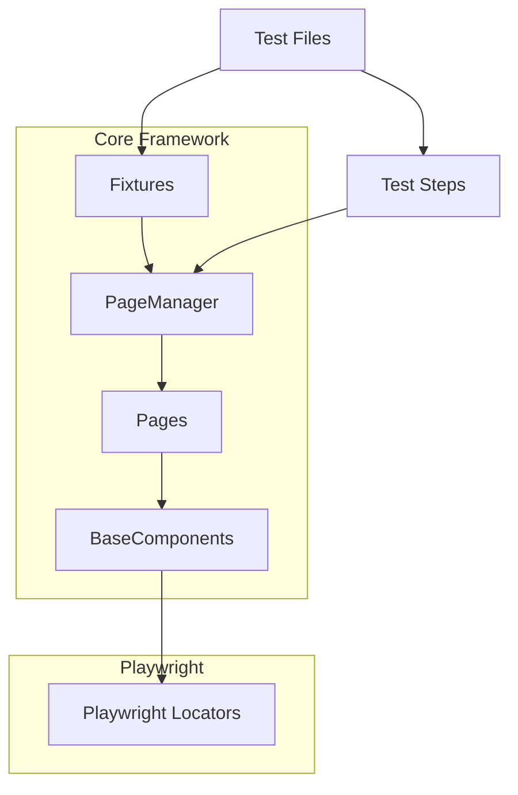

# Playwright TypeScript Test Framework

A comprehensive end-to-end testing framework built with Playwright and TypeScript, following the Page Object Model pattern and component-based architecture.

## Table of Contents

- [Overview](#overview)
- [Framework Architecture](#framework-architecture)
  - [Architecture Diagram](#architecture-diagram)
  - [Key Components](#key-components)
- [Project Structure](#project-structure)
- [Core Concepts](#core-concepts)
  - [BaseComponent](#basecomponent)
  - [Page Objects](#page-objects)
  - [PageManager](#pagemanager)
  - [Fixtures](#fixtures)
  - [Test Steps](#test-steps)
- [Getting Started](#getting-started)
  - [Prerequisites](#prerequisites)
  - [Installation](#installation)
  - [Running Tests](#running-tests)
- [Docker Support](#docker-support)
- [Writing Tests](#writing-tests)
  - [Example Test](#example-test)
  - [Using Fixtures](#using-fixtures)
  - [Working with Components](#working-with-components)

## Overview

This framework provides a structured approach to writing end-to-end tests for web applications using Playwright and TypeScript. It implements the Page Object Model (POM) pattern and component-based architecture to create maintainable, reusable, and readable tests.

Key features:
- Component-based architecture for reusing UI elements
- TypeScript for type safety and better IDE support
- Custom authentication fixtures for efficient test setup
- Docker support for consistent test execution
- Comprehensive HTML reporting

## Framework Architecture

### Architecture Diagram



### Key Components

- **Tests**: Individual test files that use the framework to automate test scenarios
- **Fixtures**: Reusable setup components (like authentication) that run before tests
- **PageManager**: Central access point to all pages in the application
- **Pages**: Representations of application pages with their elements and actions
- **BaseComponents**: Reusable UI components that can be used across different pages
- **Test Steps**: Logical grouping of test actions for better reporting and organization

## Project Structure

```
├── fixtures.ts                  # Custom test fixtures
├── page-objects/                # Page objects and components
│   ├── pageManager.ts           # Central access point for all pages
│   ├── BaseComponent.ts         # Base component class
│   ├── LoginPage.ts             # Login page implementation
│   ├── ProductsPage.ts          # Products page implementation
│   ├── ProductCard.ts           # Product card component
│   ├── CartPage.ts              # Cart page implementation 
│   ├── CartItem.ts              # Cart item component
│   └── CheckoutForm.ts          # Checkout form implementation
├── tests/                       # Test files
│   ├── test-shop.spec.ts        # Main ordering flow test
│   └── test-sort.spec.ts        # Product sorting tests
├── playwright.config.ts         # Playwright configuration
├── package.json                 # Project dependencies
├── Dockerfile                   # Docker setup
└── README.md                    # Project documentation
```

## Core Concepts

### BaseComponent

The `BaseComponent` class is the foundation of our component-based architecture. It encapsulates a Playwright Locator and provides methods for interacting with elements in a consistent way.

**Key features:**

- Wraps Playwright's Locator API with more readable methods
- Provides a way to find child elements within a component
- Creates a reusable component that can be used across multiple pages
- Implements common actions like click, getText, etc.

**Example:**

```typescript
import { Locator, Page } from '@playwright/test';

export class BaseComponent {
  readonly root: Locator;
  readonly page: Page;
  
  constructor(root: Locator, page: Page) {
    this.root = root;
    this.page = page;
  }

  // Find a child element within this component
  locator(selector: string): Locator {
    return this.root.locator(selector);
  }

  // Check if component is visible
  async isVisible(): Promise<boolean> {
    return this.root.isVisible();
  }

  // Get text content
  async getText(): Promise<string> {
    const text = await this.root.textContent();
    return text ? text.trim() : '';
  }

  // Wait for component to be visible
  async waitForVisible(timeout?: number): Promise<void> {
    await this.root.waitFor({ state: 'visible', timeout });
  }
  
  // More helper methods...
}
```

**Why it's important:** BaseComponent is critical because it:
1. Provides a consistent API for all components
2. Reduces code duplication
3. Makes tests more maintainable by centralizing element interactions
4. Creates a natural hierarchy of elements that mirrors the application's UI

### Page Objects

Page Objects represent individual pages in the application. They contain locators for the elements on the page and methods that represent actions a user can take.

**Example:**

```typescript
import { Page } from '@playwright/test';
import { BaseComponent } from './BaseComponent';
import { ProductCard } from './ProductCard';

export class ProductsPage {
  readonly page: Page;
  
  constructor(page: Page) {
    this.page = page;
  }

  // Page elements as components
  get sortDropdown() { 
    return new BaseComponent(this.page.locator('[data-test="product_sort_container"]'), this.page);
  }
  
  get cartButton() { 
    return new BaseComponent(this.page.locator('.shopping_cart_link'), this.page);
  }

  // Get all product cards on the page
  async getProductCards(): Promise<ProductCard[]> {
    const productLocators = await this.page.locator('.inventory_item').all();
    return productLocators.map(locator => new ProductCard(locator, this.page));
  }

  // Sort products by the given option
  async sortProducts(option: string): Promise<void> {
    await this.sortDropdown.locator('').selectOption(option);
  }
  
  // Go to cart
  async goToCart(): Promise<void> {
    await this.cartButton.click();
  }
}
```

### PageManager

The PageManager provides centralized access to all page objects, making it easier to use them in tests. It instantiates all page objects with the current Playwright page.

**Example:**

```typescript
import { Page } from '@playwright/test';
import { LoginPage } from './LoginPage';
import { ProductsPage } from './ProductsPage';
import { CartPage } from './CartPage';
import { CheckoutForm } from './CheckoutForm';

export class PageManager {
  readonly page: Page;
  readonly loginPage: LoginPage;
  readonly productsPage: ProductsPage;
  readonly cartPage: CartPage;
  readonly checkoutForm: CheckoutForm;
  
  constructor(page: Page) {
    this.page = page;
    this.loginPage = new LoginPage(page);
    this.productsPage = new ProductsPage(page);
    this.cartPage = new CartPage(page);
    this.checkoutForm = new CheckoutForm(page);
  }
}
```

**Why it's important:** PageManager simplifies test writing by:
1. Providing a single access point for all pages
2. Handling page instantiation automatically
3. Enforcing consistent page initialization
4. Making tests cleaner and more focused on business logic

### Fixtures

Fixtures are reusable setup components that run before tests. They help create consistent test environments and reduce test setup code.

Our framework uses custom fixtures to handle authentication, providing tests with pre-authenticated pages.

**Example:**

```typescript
import { test as base, Page } from '@playwright/test';
import { PageManager } from './page-objects/pageManager';

// Define custom fixtures
type ShopFixtures = {
  authenticatedPage: Page;
  pagesObj: PageManager;
};

// Extend Playwright's test with our fixtures
export const test = base.extend<ShopFixtures>({
  // Fixture for authenticated page
  authenticatedPage: async ({ browser }, use) => {
    const context = await browser.newContext();
    const page = await context.newPage();
    
    // Login process
    const pages = new PageManager(page);
    await pages.loginPage.openPage();
    await pages.loginPage.usernameInput.fill('standard_user');
    await pages.loginPage.passwordInput.fill('secret_sauce');
    await pages.loginPage.loginButton.click();
    await pages.productsPage.sortDropdown.waitForVisible();
    
    // Provide the authenticated page to the test
    await use(page);
    
    // Clean up
    await context.close();
  },
  
  // Fixture for PageManager with authenticated page
  pagesObj: async ({ authenticatedPage }, use) => {
    const pagesObj = new PageManager(authenticatedPage);
    await use(pagesObj);
  },
});

// Export expect for convenience
export { expect } from '@playwright/test';
```

**Why it's important:** Fixtures are crucial because they:
1. Make tests more efficient by reusing setup code
2. Ensure consistent test prerequisites
3. Separate test setup from test actions
4. Make tests more readable by focusing on the test scenarios, not the setup
5. Provide clean teardown after tests complete

### Test Steps

Test steps provide logical grouping of test actions for better organization and reporting. Playwright's `test.step()` function lets you create named steps in your tests.

**Example:**

```typescript
import { test, expect } from '../fixtures';

test('Complete purchase flow', async ({ pagesObj }) => {
  await test.step('Verify products are displayed', async () => {
    const products = await pagesObj.productsPage.getProductCards();
    expect(products.length).toBe(6);
  });

  await test.step('Add a product to cart', async () => {
    const products = await pagesObj.productsPage.getProductCards();
    const product = products[0];
    await product.addToCart();
    expect(await product.isAddedToCart()).toBe(true);
  });

  await test.step('Complete checkout process', async () => {
    await pagesObj.productsPage.goToCart();
    await pagesObj.cartPage.checkoutButton.click();
    await pagesObj.checkoutForm.firstNameInput.fill('John');
    await pagesObj.checkoutForm.lastNameInput.fill('Doe');
    await pagesObj.checkoutForm.zipCodeInput.fill('12345');
    await pagesObj.checkoutForm.continueButton.click();
    await pagesObj.checkoutForm.finishButton.click();
  });

  await test.step('Verify order confirmation', async () => {
    const completeHeader = await pagesObj.checkoutForm.completeHeader.getText();
    expect(completeHeader).toBe('Thank you for your order!');
  });
});
```

**Why it's important:** Test steps are valuable because they:
1. Improve test readability by organizing logical actions
2. Enhance reports with step-by-step results
3. Provide better failure context in reports
4. Make tests more maintainable by creating logical groupings

## Getting Started

### Prerequisites

- Node.js (version 16 or higher)
- npm or yarn
- Docker (optional, for containerized execution)

### Installation

1. Clone the repository:
   ```bash
   git clone https://github.com/yourusername/playwright-typescript-framework.git
   cd playwright-typescript-framework
   ```

2. Install dependencies:
   ```bash
   npm install
   ```

3. Install Playwright browsers:
   ```bash
   npx playwright install
   ```

### Running Tests

```bash
# Run all tests
npx playwright test

# Run with UI mode
npx playwright test --ui

# Run tests in headed browsers
npx playwright test --headed

# Run a specific test file
npx playwright test tests/test-shop.spec.ts

# Run tests with a specific tag
npx playwright test --grep @AQA-1

# Show HTML report
npx playwright show-report
```

## Docker Support

This framework includes Docker support for consistent test execution across environments.

### Running Tests with Docker

```bash
# Build the Docker image
docker build -t playwright-tests .

# Run tests in a container
docker run --rm -v $(pwd)/playwright-report:/app/playwright-report playwright-tests
```

The HTML report will be available in the `playwright-report` directory after the tests complete.

## Writing Tests

### Example Test

```typescript
import { test, expect } from '../fixtures';

test('Order T-Shirt Test @AQA-1', async ({ pagesObj }) => {
  // Step 1: Verify products are displayed
  const products = await pagesObj.productsPage.getProductCards();
  expect(products.length).toBe(6);

  // Step 2: Verify first product details
  const product = products[0];
  expect(await product.getTitle()).toBe('Sauce Labs Backpack');
  
  // Step 3: Add product to cart
  await product.addToCartButton.click();
  expect(await product.isAddedToCart()).toBe(true);
  
  // Step 4: Go to cart
  await pagesObj.productsPage.cartButton.click();
  await pagesObj.cartPage.checkoutButton.waitForVisible();
  
  // Step 5: Complete checkout process
  await pagesObj.cartPage.checkoutButton.click();
  await pagesObj.checkoutForm.firstNameInput.fill('John');
  await pagesObj.checkoutForm.lastNameInput.fill('Doe');
  await pagesObj.checkoutForm.zipCodeInput.fill('12345');
  await pagesObj.checkoutForm.continueButton.click();
  await pagesObj.checkoutForm.finishButton.click();
  
  // Step 6: Verify order confirmation
  expect(await pagesObj.checkoutForm.completeHeader.getText())
    .toBe('Thank you for your order!');
});
```

### Using Fixtures

Import the custom fixtures at the top of your test file:

```typescript
import { test, expect } from '../fixtures';

test('My Test', async ({ pagesObj }) => {
  // pagesObj is already authenticated and ready to use
  await pagesObj.productsPage.sortDropdown.click();
});
```

### Working with Components

Create a component by extending BaseComponent:

```typescript
import { Locator, Page } from '@playwright/test';
import { BaseComponent } from './BaseComponent';

export class ProductCard extends BaseComponent {
  constructor(root: Locator, page: Page) {
    super(root, page);
  }

  // Child elements
  get titleElement() { return this.locator('.inventory_item_name'); }
  get priceElement() { return this.locator('.inventory_item_price'); }
  get addToCartButton() { return this.locator('button[id^="add-to-cart"]'); }

  // Component methods
  async getTitle(): Promise<string> {
    return (await this.titleElement.textContent() || '').trim();
  }

  async getPrice(): Promise<string> {
    return (await this.priceElement.textContent() || '').trim();
  }

  async addToCart(): Promise<void> {
    await this.addToCartButton.click();
  }
}
```

Use the component in a page:

```typescript
// Inside a Page class
async getProductCards(): Promise<ProductCard[]> {
  const productLocators = await this.page.locator('.inventory_item').all();
  return productLocators.map(locator => new ProductCard(locator, this.page));
}
```